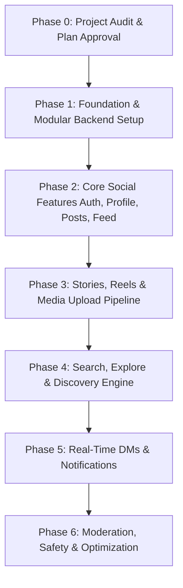

Ran command: `find . -maxdepth 3 -not -path '*/.*' | sort`
Ran command: `find . -maxdepth 5 -not -path '*/.*' -not -path './node_modules*' | sort`
Viewed package.json:1-49
Viewed AGENTS.md:1-4
Viewed CLAUDE.md:1-2
Viewed app.json:1-49
Viewed index.tsx:1-6
Viewed _layout.tsx:1-27
Viewed login.tsx:1-800
Viewed index.tsx:1-242
Viewed explore.tsx:1-454
Viewed validation.ts:1-151
Viewed theme.ts:1-77
Viewed reels.tsx:1-161
Viewed profile.tsx:1-243

# DEEPSTA - Phase 0 Comprehensive Technical Audit & Architecture Report

> [!IMPORTANT]
> **Audit Status**: Complete. **No code modified during audit**. Per Section 43 rules, implementation will begin after your explicit approval of this audit and roadmap proposal.

---

## A. Current Project Structure

The project is currently a **React Native / Expo v54** mobile application utilizing Expo Router (file-based navigation), TypeScript, and React 19.

```text
deepsta/
├── AGENTS.md                   # Version guidelines (Expo v54.0.0 reference)
├── CLAUDE.md                   # AGENTS reference pointer
├── app.json                    # Expo config (New Architecture enabled, typed routes, dark splash)
├── package.json                # Dependencies (Expo ~54.0.35, React 19.1, RN 0.81.5, Expo Router 6.0)
├── tsconfig.json               # TypeScript config with `@/*` path alias mapping
├── eslint.config.js            # Expo ESLint setup
├── app/                        # Expo Router App Root Directory
│   ├── _layout.tsx             # Root layout with Hardcoded DarkTheme Provider & Stack Router
│   ├── index.tsx               # Redirects immediately to /(auth)/login
│   ├── modal.tsx               # Native modal demo screen
│   ├── (auth)/                 # Authentication route group
│   │   ├── _layout.tsx         # Auth stack layout
│   │   ├── login.tsx           # Login screen (Mock login, social auth modal, reset password modal)
│   │   └── register.tsx        # Registration screen (Multi-step form, security rules indicator)
│   ├── (tabs)/                 # Main Navigation Tab Bar Group
│   │   ├── _layout.tsx         # Custom bottom tab navigation bar with haptics & blur
│   │   ├── index.tsx           # Home Feed screen (Mock stories bar, post list, endless loading)
│   │   ├── explore.tsx         # Search & Discovery (Grid / Accounts tab view, category filters)
│   │   ├── create.tsx          # Post / Story / Reel Creation (Mock photo picker & filters)
│   │   ├── reels.tsx           # Vertical Reels feed (Snap scrolling list, action bar)
│   │   └── profile.tsx         # User Profile (Header stats, grid tabs, hamburger settings sheet)
│   ├── messages/               # Direct Messaging route group
│   │   └── index.tsx           # DM inbox & conversation chat screen
│   ├── notifications/          # Notifications route group
│   │   └── index.tsx           # Activity notification feed (Likes, comments, follows)
│   └── settings/               # Settings & Analytics sub-routes
│       ├── index.tsx           # Settings & Privacy screen
│       ├── activity.tsx        # Account activity log
│       ├── archive.tsx         # Archived posts & stories
│       ├── insights.tsx        # Creator analytics & performance insights
│       └── saved.tsx           # Bookmarked posts collection
├── components/                 # UI & Feature components
│   ├── deepsta/                # Custom Deepsta application components
│   │   ├── CommentDrawerModal.tsx  # Slide-up comment sheet with inline reply state
│   │   ├── FeedHeader.tsx          # Top bar with dropdown feed switcher & badge counts
│   │   ├── LiveStreamModal.tsx     # Interactive live stream preview simulation
│   │   ├── PostCard.tsx            # Feed card with media, audio track, action bar & double-tap like
│   │   ├── ProfileHeader.tsx       # Profile hero banner with stats, bio & edit buttons
│   │   ├── ReelItem.tsx            # Reel item with action sidebar & creator avatar
│   │   ├── StoryRing.tsx           # Gradient story ring avatar component
│   │   └── StoryViewerModal.tsx    # Full-screen story progress viewer with auto-timer
│   ├── ui/                     # Primitive UI controls
│   │   ├── collapsible.tsx
│   │   └── icon-symbol.tsx
│   ├── external-link.tsx
│   ├── haptic-tab.tsx
│   ├── hello-wave.tsx
│   ├── parallax-scroll-view.tsx
│   ├── themed-text.tsx
│   └── themed-view.tsx
├── constants/
│   └── theme.ts                # BrandColors palette (Magenta #FF3B70, Obsidian #090C15, Violet #8A2BE2)
├── hooks/                      # Custom hooks (Color scheme resolution)
│   ├── use-color-scheme.ts
│   ├── use-color-scheme.web.ts
│   └── use-theme-color.ts
├── utils/
│   └── validation.ts           # SecurityUtils (Input sanitization, RFC 5322 Email validation, password rules)
└── scripts/
    └── reset-project.js
```

---

## B. Technology Stack Identification

| Layer / Concern | Technology Identified | Status / Notes |
|---|---|---|
| **Frontend Framework** | React 19.1.0, React Native 0.81.5, Expo SDK ~54.0.35 | `newArchEnabled: true` set in `app.json` |
| **Routing / Navigation** | Expo Router ~6.0.24, React Navigation v7 | File-based routing with typed routes enabled |
| **Backend Framework** | **Missing** | App relies on local `setTimeout` mock timers |
| **Database** | **Missing** | No database client or schema migrations present |
| **Authentication** | **Partial (Mock)** | Input validation & UI state exist; backend JWT/Session flow missing |
| **State Management** | **Local State Only** | `useState` used locally in each component; no server state cache |
| **API Architecture** | **Missing** | No HTTP client (`axios`/`fetch` wrapper) or REST/GraphQL layer |
| **Media / Storage** | **Static URLs** | Hardcoded Unsplash placeholder images |
| **Styling Engine** | React Native `StyleSheet` + `expo-linear-gradient` | Clean Obsidian/Neon dark design system |
| **Build & Tooling** | Expo CLI, TypeScript ~5.9.2, ESLint 9 (`eslint-config-expo`) | Configured and working |
| **Testing Suite** | **Missing** | Zero test files exist |

---

## C. Existing Features Matrix

| Feature | Existing | Partial | Missing | Problem / Technical Detail |
|---|:---:|:---:|:---:|---|
| **Auth** | | ⚠️ Partial | | Form UI and validation (`validation.ts`) are high quality, but auth is simulated via timers without persistent tokens or backend endpoints. |
| **Profile** | | ⚠️ Partial | | Profile header, stats, bio, grid tabs, and settings drawer exist, but data is static and cannot be edited. |
| **Follow Social Graph** | | ⚠️ Partial | | Follow/Unfollow toggle UI works in Explore, but state is lost on reload and lacks follow requests / block checks. |
| **Posts** | | ⚠️ Partial | | `PostCard` renders rich posts with audio tracks & like counters, but data is hardcoded; `create.tsx` lacks actual image processing. |
| **Likes** | | ⚠️ Partial | | Double-tap animation and heart button toggles work in memory, but have no optimistic server sync. |
| **Comments** | | ⚠️ Partial | | `CommentDrawerModal` opens with inline typing, but comments are not saved across app restarts. |
| **Saves** | | ⚠️ Partial | | Bookmark button state works locally, saved list screen exists in settings, but lacks API integration. |
| **Stories** | | ⚠️ Partial | | `StoryRing` and `StoryViewerModal` display progress bars, but expiration logic (24h time-decay) and upload flows are missing. |
| **Highlights** | | | ❌ Missing | Profile highlights carousel is not yet implemented. |
| **Reels** | | ⚠️ Partial | | Snap-scrolling vertical feed exists in `reels.tsx`, but uses static `Image` instead of true video streaming (`expo-video`). |
| **Feed** | | ⚠️ Partial | | Chronological feed with pull-to-refresh works using mock array mutation, but lacks cursor pagination REST/GraphQL API. |
| **Search** | | ⚠️ Partial | | Client-side filter on static items in `explore.tsx`, no backend full-text query or hashtag indexing. |
| **Explore** | | ⚠️ Partial | | Filter tabs (Top, Accounts, Reels) and grid view with avatar tags work visually, but data is static. |
| **DM / Messaging** | | ⚠️ Partial | | Conversation inbox and chat screen exist in `app/messages`, but no WebSocket connection or real-time event system. |
| **Notifications** | | ⚠️ Partial | | Notification list UI exists in `app/notifications`, but no push notification server (FCM/APNs) or trigger hooks. |
| **Media Upload** | | | ❌ Missing | No presigned S3/R2 upload flow, client-side image compression, or file type validation. |
| **Location** | | ⚠️ Partial | | Posts display static location strings (e.g. "Shibuya, Tokyo"), but GPS device tagging is missing. |
| **Camera** | | ⚠️ Partial | | Mock camera preview in `create.tsx`, native camera controls (`expo-camera`) not yet integrated. |
| **Moderation & Safety**| | | ❌ Missing | No user reporting forms, admin queue, block/restrict lists, or spam rate limiters. |
| **Recommendations** | | | ❌ Missing | No candidate generation, deterministic scoring, or ranking pipeline. |

---

## D. Code Quality & Architectural Audit

1. **Lack of Backend & API Integration Layer**:
   - All screens currently depend on inline mock constants (`POSTS`, `STORIES`, `EXPLORE_GRID_ITEMS`, `PROVIDER_DATA`).
   - Network API abstraction (`services/api.ts`) is missing.
2. **State Management Fragmentation**:
   - Server state is scattered across screen components. Liking a post in the Home Feed does not update the same post in the Profile Grid or Explore screen because there is no unified state cache (e.g. TanStack Query or Zustand store).
3. **Hardcoded Dark Theme Provider**:
   - `app/_layout.tsx` hardcodes `<ThemeProvider value={DarkTheme}>`, which ignores system light/dark mode preference changes.
4. **Reels Component Media Limitation**:
   - `ReelItem.tsx` uses standard React Native `Image` tags for video previews. True video playback requires `expo-video` with buffering and autoplay controls.
5. **Component Size & Monolithic Screen Files**:
   - `app/(auth)/login.tsx` is over 1,000 lines long, combining UI layout, form state, social auth modal logic, forgot password modal, and inline styles into a single file.
6. **Zero Automated Tests**:
   - No unit or integration tests exist to prevent regression when refactoring.

---

## E. Proposed Target Architecture

We will adopt a **Modular Monolith Backend + Domain-Driven Frontend** architecture. This avoids premature microservice overhead while enforcing strict module boundaries so components can be cleanly separated or extracted into microservices in the future.

### Conceptual Monolithic & API Layer
```text
                      EXPO REACT NATIVE FRONTEND
                                   |
                                   v
                         API / BFF LAYER (REST API v1)
                                   |
             +---------------------+---------------------+
             |                                           |
             v                                           v
      Modular Node.js/TS Backend                   WebSockets Gateway
      (Express / Fastify + Prisma)                 (Socket.io / ws)
             |                                           |
   +---------+---------+---------+                       |
   |                   |         |                       |
   v                   v         v                       v
PostgreSQL          Redis    Object Storage       Realtime DM Messages
(Main Storage)      (Cache)  (Cloudflare R2/S3)
```

### Proposed Directory Organization (Zero-Destruction Refactor)

```text
deepsta/
├── app/                        # Expo Router Pages (UI Routes ONLY - calls hooks/services)
├── backend/                    # Modular Monolith Node.js Backend API
│   ├── src/
│   │   ├── config/             # DB, Storage, Auth configs
│   │   ├── middleware/         # JWT Auth, Rate limiting, Error Handling
│   │   ├── modules/
│   │   │   ├── auth/           # Controller, Service, Repository, Schema
│   │   │   ├── users/          # Profile, Follows, Blocks
│   │   │   ├── posts/          # Feed, Likes, Comments, Media
│   │   │   ├── stories/        # Story creation, 24h decay logic
│   │   │   ├── reels/          # Video metadata & watch-time tracking
│   │   │   ├── messages/       # Chat history & WebSockets
│   │   │   └── media/          # Upload pre-signed URLs & processing
│   │   └── server.ts
│   └── package.json
├── src/                        # Clean Frontend Core
│   ├── features/               # Domain logic (auth, feed, profile, reels, messages)
│   │   ├── auth/ (hooks, services, types)
│   │   ├── feed/ (hooks, services, types)
│   │   └── profile/ ...
│   ├── services/               # API HTTP Client & WebSocket Singleton
│   ├── store/                  # Global UI & Auth Session state (Zustand)
│   └── lib/                    # Storage & Image utilities
```

---

## F. Progressive Migration Plan



1. **Phase 1 (Foundation)**: Setup modular backend in Node.js/TypeScript with PostgreSQL (Prisma/Kysely), JWT authentication, storage provider abstraction, and TanStack Query on the frontend.
2. **Phase 2 (Core Social Platform)**: Connect user profiles, follow graph, post creation, likes, comments, and feed cursor pagination.
3. **Phase 3 (Stories & Reels)**: Implement 24h story decay, presigned Cloudflare R2 / S3 media uploads, video streaming (`expo-video`), and watch-time events.
4. **Phase 4 (Discovery & Search)**: Add full-text username/hashtag search endpoints, explore grid scoring algorithm, and trending reels ranking.
5. **Phase 5 (Communication & Realtime)**: Integrate WebSockets for 1-on-1 DM chatting, typing status, and in-app notifications.
6. **Phase 6 (Safety & Optimization)**: Add content reporting queues, block/restrict filters, rate limiters, and end-to-end integration tests.

---

## G. Feature Priority Roadmap

- **P0 (Must Have - MVP Core)**:
  - Auth Service (JWT Register, Login, Refresh, Logout).
  - User Profiles & Follow/Unfollow Graph.
  - Post Creation (Single & Carousel Images) & Object Storage Upload.
  - Cursor-Paginated Home Feed.
  - Like & Comment System.
- **P1 (Important)**:
  - Reels Feed with Native Video Player (`expo-video`).
  - Stories with 24-hour expiration time-decay logic.
  - Real-Time Direct Messaging (WebSockets).
  - Search & Explore API (Hashtags, User Accounts, Grid Filters).
- **P2 (Later)**:
  - Story Highlights on User Profiles.
  - Push Notifications (Expo Notifications / FCM).
  - Account Analytics & Insights Dashboard.
  - User Reporting & Content Moderation Queue.
- **P3 (Future / Scaling)**:
  - Deterministic / ML Video Recommendation Engine.
  - AR Camera Filters Integration.
  - Kafka Event Pipeline (Only when microservice extraction is justified).

---

## H. Free Infrastructure Plan (Zero-Cost Stack)

During initial development and testing, the application will run entirely on verified **Free Tier** or self-hosted open-source technologies:

1. **Database**: PostgreSQL on **Supabase Free Tier** (500MB DB, zero cost) or local Docker PostgreSQL container during offline development.
2. **Object Storage**: **Cloudflare R2** (Free Tier: 10 GB storage per month, 10 Million read operations, **$0 Egress fees**) with a pluggable `StorageProvider` interface allowing seamless migration to AWS S3/MinIO later.
3. **Backend API Hosting**: **Render.com Free Web Service** or **Railway Free Tier** for Node.js backend hosting.
4. **Cache & Rate Limiting**: **Upstash Redis Free Tier** (10,000 requests/day free) or local Docker Redis.
5. **Mobile Build & Testing**: **Expo Go** for instant live development; **EAS Build Free Tier** for iOS/Android preview builds.

---

## I. Next Steps & Confirmation

I am ready to proceed with **Phase 1: Foundation & Backend Setup**. Please review this report and confirm if you would like me to begin establishing the modular backend and refactoring the frontend API layer.